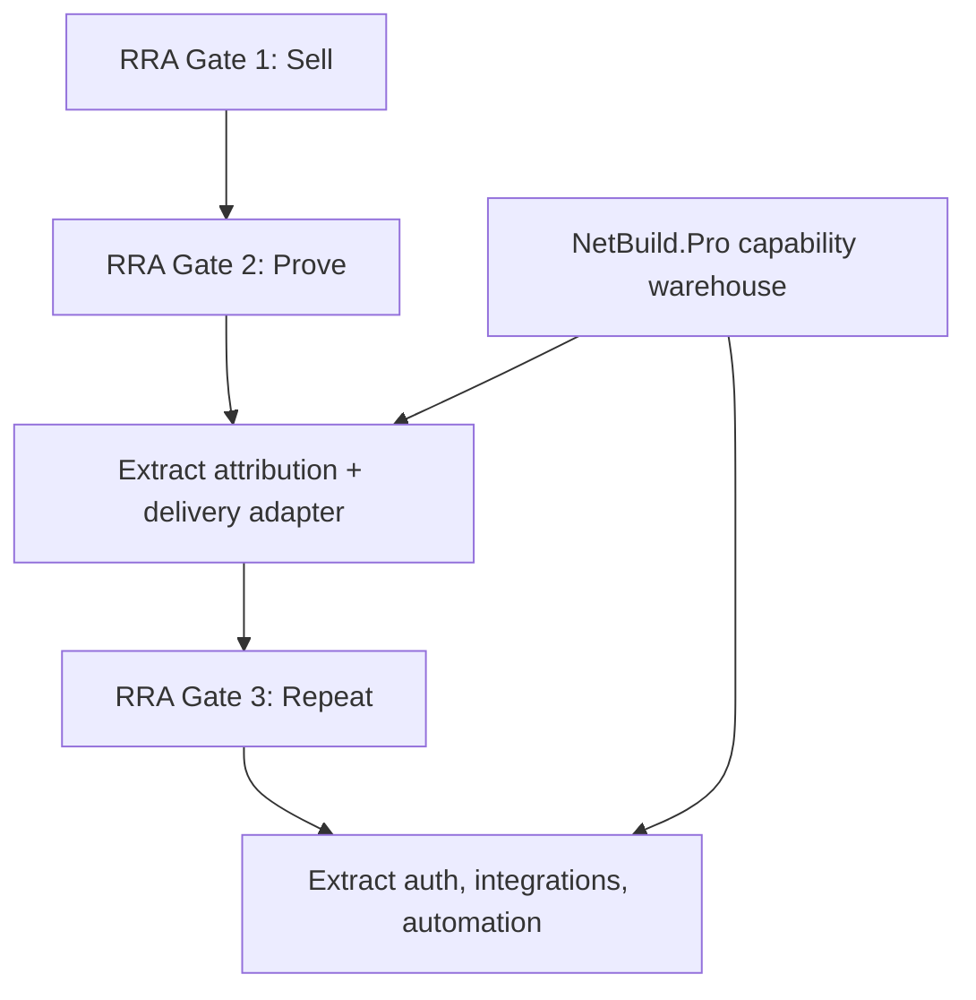

# NetBuild.Pro Reuse Strategy

NetBuild.Pro is a substantial production SaaS platform, not a small
predecessor prototype. It contains valuable RRA delivery infrastructure,
but directly merging it into RRA now would violate the launch freeze.

## Repository scope

| System | Current capability | RRA relevance |
|---|---|---|
| Angel | Chat, missed-call handling, Retell voice, appointment booking, GHL synchronization | High after first sale |
| Attribution | Append-only call events, booking counts, tenant metrics, explicitly labeled estimates | Very high for Gate 2 measurement |
| Site Magic | AI website generation, visual QA, remediation loops, publishing pipeline | Low |
| Website leads | Lead capture, validation, rate limiting, durable storage, best-effort GHL forwarding | Medium |
| Customer platform | Supabase authentication, tenant roles, dashboard, audit records | Later only |
| Rita | Review requests and response drafting | Gate 3 expansion |
| Leo | Lead qualification and opportunity scoring | Potential future prospect automation |
| Sam | Quote creation, sending, acceptance and appointment creation | Outside the initial RRA wedge |
| Integrations | GHL, Retell, ServiceTitan scaffolding, social-media bridge | Selectively useful later |
| Operations | FastAPI, Supabase/Postgres, Vercel control plane, Railway worker, OpenRouter, extensive tests | Strong reference architecture |
| Agency layer | Intake, generated sites, agency pages, reseller/multi-tenant structure | Not relevant now |

Sources: [README](https://github.com/keithtortorich/NetBuild.Pro/blob/main/README.md), [composition root](https://github.com/keithtortorich/NetBuild.Pro/blob/main/webstaffr/app.py), [API](https://github.com/keithtortorich/NetBuild.Pro/blob/main/docs/API.md), [database](https://github.com/keithtortorich/NetBuild.Pro/blob/main/docs/DATABASE.md).

## What RRA should reuse

### Gate 1 — SELL: now

Reuse ideas only, not code:

- Evidence classification: known versus estimated versus benchmark.
- Conservative calculations with no fabricated revenue claims.
- One tenant/prospect scoped through every operation.
- Durable activity/evidence logs.
- No external integration failure should destroy locally saved evidence.

RRA already embodies most of this. Nothing from NetBuild.Pro justifies
adding software before the first $997 sale.

### Gate 2 — PROVE: after the first sale

This is where NetBuild.Pro becomes genuinely valuable:

1. **Append-only intervention events**

   Adapt its `call_events` model into an RRA measurement ledger:

   - Baseline captured
   - Fix activated
   - Call received
   - Call answered
   - Appointment booked
   - Outcome verified
   - Revenue confirmed

2. **Attribution discipline**

   Its separation of measured events from `estimated_value_usd` is exactly
   right. RRA should retain this distinction and never present appointment
   value as recovered revenue without confirmation. See
   [attribution.py](https://github.com/keithtortorich/NetBuild.Pro/blob/main/webstaffr/attribution.py).

3. **Missed-call recovery implementation**

   Angel's GHL missed-call trigger, conversation handling and booking path
   can eventually become one delivery adapter for the $997 fix. See
   [Angel router](https://github.com/keithtortorich/NetBuild.Pro/blob/main/webstaffr/workers/angel/router.py).

4. **Reliable integration pattern**

   Preserve the `Protocol → Null implementation → real implementation`
   pattern. It allows manual delivery first and vendor automation later
   without redesigning the core workflow.

5. **Persist first, forward second**

   NetBuild.Pro stores a lead before attempting GHL synchronization. That
   prevents vendor failures from losing evidence or customer data. See
   [website lead router](https://github.com/keithtortorich/NetBuild.Pro/blob/main/webstaffr/website_lead_router.py).

### Gate 3 — REPEAT: only after repeated delivery

Potential later extractions:

- Tenant/customer isolation
- Authenticated client reporting
- Dashboard projections
- GHL and ServiceTitan adapters
- Retry/idempotency patterns
- Review-request automation
- Automated prospect qualification
- Structured workflow execution and audit events

These should be copied as isolated patterns or adapters, not by turning
RRA back into NetBuild.Pro.

## What should remain frozen

Do not move these into RRA yet:

- Site Magic and website generation
- Customer authentication
- SaaS dashboard
- Multi-worker architecture
- Rita, Leo or Sam
- Reseller and white-label features
- Agency website
- Billing or subscription tiers
- Multi-vertical support
- ServiceTitan production wiring
- Autonomous workflow execution
- Marketing Coordinator integration

They increase operational surface without improving the probability of the
first $997 sale.

## Important repo findings

The codebase appears stronger and broader than its headline documentation
suggests:

- README still describes 169 tests, while later production commits report
  **824 Python tests plus 139 Node Site Magic tests**.
- `docs/ARCHITECTURE.md` largely describes an Angel-only FastAPI
  application, but the current composition root includes Angel, Rita, Leo,
  Sam, customer auth, dashboards, leads and Site Magic.
- `HANDOFF.md` explicitly contains historical state and should not be
  treated as current truth.
- NetBuild.Pro's commercial assumptions conflict with RRA: AI workforce
  SaaS, recurring subscription pricing and broader delivery scope versus
  RRA's fixed-fee validated-leak model.

Therefore, the code is the trustworthy source; several overview documents
have drifted.

## Final decision

Keep the repositories separate.

Treat NetBuild.Pro as RRA's **capability warehouse**, not its foundation:

The first extraction after a sale should be the **measurement and
attribution model**, followed by the **missed-call recovery adapter**.
Everything else stays dormant until customer evidence proves it is needed.
